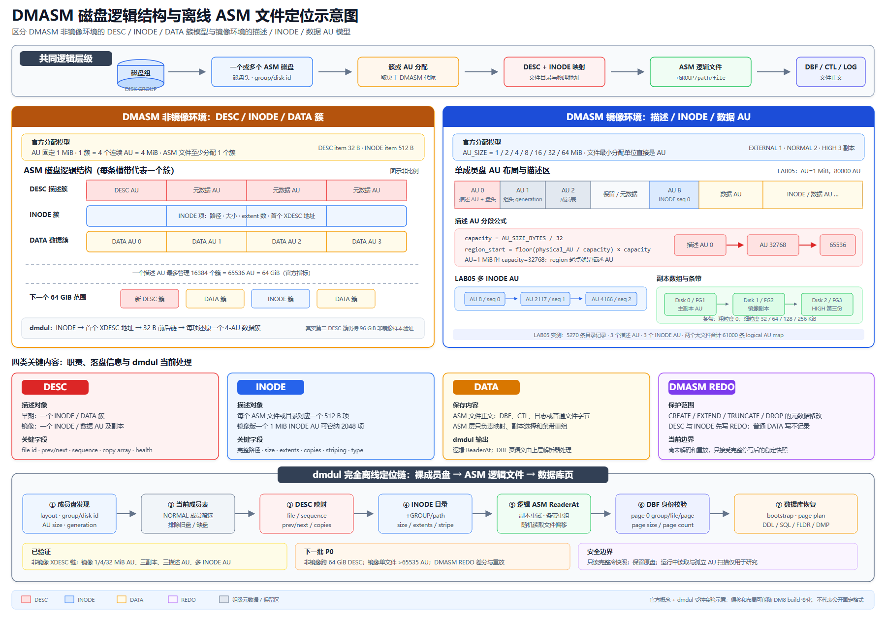

# dmdul

<p align="center">
  
</p>

**Dameng Database Offline Recovery & Data Unloader**

**达梦数据库离线恢复与数据抽取工具**

`dmdul` 是一个使用 Go 编写的达梦数据库离线恢复与数据抽取工具。当数据库无法正常
`open`、无法通过常规恢复流程启动时，它可以直接读取 `SYSTEM.DBF`、可选的 `dm.ctl`
以及用户表空间 DBF 文件，也可以从离线 DMASM 裸盘恢复这些逻辑文件：

- 恢复数据库对象定义和用户字典；
- 导出表结构及相关对象 DDL；
- 导出 SQL、dmfldr 分隔文本或达梦 DMP 数据；
- 尝试恢复 `DELETE` / `DROP` / `TRUNCATE` 后尚未被覆盖的残留数据；
- 处理大表、分区表、行外 LOB 和 `STORAGE(USING LONG ROW)` 场景。
- 无需启动 DMASMSVR 或执行 `asmcmd cp`，直接读取非镜像与镜像 DMASM 元数据、
  AU 映射、副本数组和条带数据。

**v0.7.2 主题：DMASM Multi-Database Discovery**


> `dmdul` 不是常规备份恢复工具，也不能替代 DMRMAN、归档恢复、闪回、`dexp`
> 或专业数据恢复流程。它更适合作为极端故障场景下的最后手段。所有导出的 DDL
> 和数据都必须先在隔离测试库验证。

------

## 项目定位

当前能力链由两条离线输入路径汇合：文件系统中的 DBF 可以直接读取；DMASM 成员裸盘
必须先恢复磁盘组目录和 AU 映射，映射为只读 ASM 逻辑文件。两条路径随后共用同一套
Standard Bootstrap、字典恢复和数据导出流程：

```text
Offline filesystem                         Offline DMASM member disks
SYSTEM.DBF / user tablespace DBFs          raw devices / *-flat.vmdk
(optional dm.ctl cross-reference)                       |
        |                                               v
        |                                  DMASM disk-group recovery
        |                             member catalog / INODE / descriptor
        |                                  AU copies / striping map
        |                                               |
        |                                               v
        |                                  ASM logical DBF files
        |                                  +GROUP/.../*.DBF
        |                                               |
        +-----------------------+-----------------------+
                                |
                                v
                 Unified read-only logical DBF source
                    SYSTEM.DBF + user tablespace DBFs
                                |
                                v
                       Standard Bootstrap
                                |
                                v
                      Dictionary Recovery
                                |
             +------------------+-------------------+
             |                  |                   |
             v                  v                   v
       DDL / INSERT SQL    FLDR text + CTL      Native DMP
             |                  |                   |
             v                  v                   v
           disql              dmfldr               dimp
             |                  |                   |
             +------------------+-------------------+
                                |
                                v
                        Dameng Database
```

它更接近“离线字典恢复 + DUL + 原生逻辑 DMP 输出”的组合工具，而不再只是一个
生成 `INSERT` 语句的简单抽取程序。DMP 采用达梦 `FULL / OWNER / SCHEMAS / TABLES`
逻辑级别，在同一个文件中保存可恢复的对象元数据和表数据；配套 SQL DDL 继续保留，
用于审查、人工修订和无法由 DMP 覆盖时的兜底恢复。

------

## 存储结构理解

下面三张示意图概括了 `dmdul` 当前采用的结构理解：第一张从 DMASM 成员盘进入 ASM
文件；第二张从 `SYSTEM.DBF` 的 page 0 锚点进入系统字典；第三张展示典型 8K 数据页中
页头、行记录、空闲区、槽目录和页尾的组织方式。

### DMASM 磁盘与 ASM 文件定位



该图明确区分 DMASM 非镜像环境的 DESC/INODE/DATA 簇与镜像环境的描述/INODE/数据 AU，
并展示 descriptor map、INODE 目录、副本、条带和 dmdul 逻辑 `ReaderAt` 的衔接关系。

深入阅读：[DMASM 裸盘离线读取与恢复](docs/dmasm-raw-recovery.md)

### SYSTEM.DBF 与系统字典


这条链路解释了 `dmdul` 如何从原始文件进入 `SYSOBJECTS` 与 `SYSINDEXES`，再沿
`storage root -> internal refs -> leaf chain` 定位字典页，并逐步还原用户、表、列、
类型和索引等结构化元数据。

深入阅读：[SYSTEM.DBF 离线扫描与系统字典恢复](docs/offline-system-scan.md) ·
[Standard Bootstrap 字典表下载](docs/bootstrap-standard-table-download.md)

### DM8 8K 数据页布局


行记录从低地址方向增长，槽目录通常从高地址方向增长；`dmdul` 读取页头和槽目录后，
会结合 `PAGE_CHECK` 模式计算槽目录起点，按记录偏移定位行数据，并解析行长、删除标志、
NULL 元数据、列值及可选事务控制尾。读取 `SYSTEM.DBF` 字典页时，还会从页尾保留区恢复
4 KiB 扇区边界前被替换的原始字节；普通用户数据页保持磁盘原始字节。

深入阅读：[DM8 普通行页格式研究](docs/row-page-format.md) ·
[DM8 PAGE_CHECK 页校验实验](docs/page-check.md)

> **说明：** 三图基于官方概念及 `dmdul` 的研究实验，用于帮助理解解析思路，并非达梦公开的固定磁盘格式规范。
> 不同数据库版本、表类型和存储策略的实际字段布局可能存在差异，请以目标文件的解析结果为准。

------

## 核心能力

- **DMASM 裸盘读取**：只读解析 DMASM 非镜像与镜像环境的实测布局，把
  `+GROUP/path/file.DBF` 映射为随机读逻辑文件。镜像版支持 1/4/32 MiB AU、
  EXTERNAL/NORMAL/HIGH、0/32 KiB 条带、副本重试和跨磁盘组 DBF 发现；AU 1
  generation 与 AU 2 当前成员表可排除 OFFLINE、RECONNECT、DELETED 和替换后的旧盘。
  Standard Bootstrap 与用户表 page plan 直接在裸盘 reader 上运行，不依赖 DMASMSVR，
  也不生成中间 DBF 副本。详见
  [DMASM 裸盘离线读取与恢复](docs/dmasm-raw-recovery.md)。

- **Standard Bootstrap**：通过 page 0 anchor 进入 `SYSOBJECTS` / `SYSINDEXES`，再按
  storage root、内部页引用和 leaf chain 下载核心系统字典；第二阶段包含
  `SYSOBJINFOS` 分区键和 `SYSHPARTTABLEINFO` 分区明细，失败时回退按页流式扫描。
- **数据库参数恢复**：识别页大小、簇大小、页数、字符集、大小写敏感标志和实例名，
  结合可选 `dm.ctl` 恢复数据库名，并持久化到 `init.dul`。
- **磁盘字典**：生成可人工审查和修改的 `dmdul_dict/*.tsv`，再次启动后可直接
  `load dictionary;`，无需重复 bootstrap；用户与模式归属、分区键、分区顺序和完整
  二进制边界值也会落盘。表段的 `header_file/header_block/blocks/extents` 优先从
  storage page plan 推导；ASM 模式只读取计划页，不会为生成段摘要而扫描整个逻辑 DBF。
  重新 bootstrap 时先在临时目录生成并校验完整字典，再切换目录；旧字典自动备份。
- **对象恢复**：恢复用户、角色授权、表、字段、索引、约束、注释、分区、视图、
  序列、过程、函数、包、包体、触发器、同义词和对象授权；序列会沿 `INFO5` 的
  `file/page/slot` 定位器恢复安全的 `LAST_NUMBER`，避免从初始最小值重新发号。
- **分级数据卸载**：SQL/dmfldr 支持表级、用户级和整库级；DMP 对齐达梦逻辑导出语义，
  支持互斥的 `TABLES`、`OWNER`、`SCHEMAS` 和 `FULL` 四种级别，每次生成一个原生逻辑文件。
- **精确数据页定位**：为选中表及分区按 `storage root -> internal page refs -> leaf chain`
  生成 page plan；计划完整时仅用 `ReadAt` 读取计划页，失败时依次回退到同 group
  `storage_id` 扫描和段范围读取，只有 `recover table` 才执行全文件残留页扫描。
- **自动并行卸载**：page plan 直读阶段按页批次多核并行解码（worker 数自动取
  `min(CPU 核数, 8)`，无需配置）；LOB/Long Row 页链由锚点行 worker 整链跟随，
  单一 writer 按批次序合并，输出与单线程逐字节一致。实测 1000 万行表 4 核
  87 秒、8 核 49 秒完成 SQL 卸载。
- **用户页保护识别**：普通数据页先根据 `n_slot/n_rec/free_end`、slot 候选和可解码行头
  识别固定尾、HASH 尾或扇区保护尾。只有结构证据成立时，才从页尾恢复 4 KiB 边界原字节；
  其他页面保持原样，避免把 slot 或 HASH 内容误写进活动行。
- **普通行页解析**：按页尾 slot 目录定位活动行，正确解释大端行长状态字、`0x8000`
  DELETE 标志、`n_rec` 滞后和 free-row 链；普通 `unload` 不再扫描无 slot 物理空洞。
- **事务控制尾识别**：解码常见的 19 字节 `clu_rowid + rollback address + trx_id`
  行尾，为后续离线事务状态和 Undo PRE IMAGE 恢复保留结构化入口。
- **页面校验识别**：支持 `PAGE_CHECK=0/1/2/3`，识别 CRC32、页尾 HASH 和 CRC32C；
  HASH 模式下按摘要长度修正 SYSTEM 字典页、分区页和用户数据页的 slot 起点。
- **可诊断数据卸载**：控制台和 `dul.log` 记录 planned pages、direct pages read、
  fallback pages scanned 及具体 fallback reason；残留恢复还会记录源 group/file、
  `storage_id`、页范围、行数和字典/启发式归属，便于核对实际物理读取范围。
- **完整常规类型路径**：支持定长/变长字符与二进制、精确/近似数值、9 位时间戳、
  时区类型、13 种 INTERVAL、ROWID、BFILE、JSON/JSONB，以及国家字符兼容类型。
- **复杂行与大对象**：支持显式 2-bit NULL metadata；未知状态 `10` 会明确拒绝而不进行
  启发式猜测；支持 ALTER TABLE 历史短行、21 字节 LOB locator、行外 CLOB/BLOB 流式读取
  和 Long Row 页链。`STORAGE(USING LONG ROW)` 宽行的行外 VARCHAR/CHAR 列无论溢出到
  长行（0x22）页还是常规 LOB（0x20）页都能正确读出；DDL 也会还原 `USING LONG ROW`
  存储子句，配合 DMP 通道可直接由 `dimp` 导回。
- **页损坏诊断**：`check pages` 离线只读扫描数据文件，分文件大小、页头自描述、
  数据页结构三层证据定位坏页；即使 `PAGE_CHECK=0` 无校验和也能发现页头错乱、
  清零页和行长自相矛盾的结构损坏。坏页坐标 `page(tablespace,file,page)` 与官方
  dmdbchk 对齐，实测四种注入损坏 4/4 检出、干净库零误报。字典可用时进一步把坏页
  归属到 `owner.table`（storage_id 清零页经段范围回退归属）、检测 B 树叶链断链/成环、
  并做字典自一致性检查（重复 ID、悬空列、孤儿 owner）；bootstrap 流程零改动。
- **残留数据救援**：表定义仍可获得时，`recover table` 可尝试读取 DELETE slot、无 slot
  物理行以及 `DROP` / `TRUNCATE` 后尚未覆盖的残留页；孤儿 storage 仅允许单目标表恢复，
  并使用多行一致性校验和显式物理来源证据降低误归属风险。
- **大规模输出**：DBF 按页流式读取；DMP 支持 64 位长度、多 phase、大表及超过
  4 GiB 的输出路径，不需要把整个数据文件或 LOB 一次性读入内存。

格式研究记录：[DM8 DMP 逻辑导出格式实验记录](docs/dmp-format-research.md)

类型支持与实机验证：[DM8 数据类型支持矩阵](docs/data-types.md)

------

## 适用场景

| 场景                   | 说明                                                         |
| ---------------------- | ------------------------------------------------------------ |
| 数据库无法 `open`      | 实例无法正常启动，但 DBF 文件仍可读取                        |
| 常规恢复失败           | 控制文件、ROLL、REDO、归档链路异常，DMRMAN 无法完成恢复      |
| 只剩数据文件           | 仍可尝试从 `SYSTEM.DBF` 和用户表空间文件恢复对象和数据       |
| 部分数据块损坏         | 大部分页仍可读时，可尝试按页扫描恢复                         |
| DROP / TRUNCATE 后救援 | 原数据块未被覆盖时，可尝试残留页恢复                         |
| 需要恢复 DDL           | 可离线导出用户、表、视图、序列、过程、函数、包、触发器、同义词、授权等对象 |

------

## 支持能力概览

| 能力 | 状态 | 说明 |
| --- | --- | --- |
| Standard Bootstrap | ✅ 支持 | 两阶段字典下载、结构化日志、流式 fallback |
| DMASM 裸盘读取 | 🧪 实验支持 | 非镜像 + 镜像环境；AU map、NORMAL/HIGH 副本、细条带、多磁盘组、generation/成员状态筛选、缺失 group/file 预警，以及 ASM 逻辑文件流式复制 |
| `SYSTEM.DBF` 参数解析 | ✅ 支持 | extent/page/page count、字符集、大小写标志、open history 实例名 |
| `dm.ctl` / DBF 文件识别 | ✅ 支持 | 数据库名、表空间、group/file、数据文件路径 |
| `control.dul` / `init.dul` | ✅ 支持 | 文件清单、参数值、参数来源及重新加载 |
| `dmdul_dict` 磁盘字典 | ✅ 支持 | TSV 落盘、人工修订、原子重建、旧字典备份及再次参与恢复 |
| 用户、角色与授权 | ✅ 支持 | `CREATE USER`、角色授权、对象授权 |
| 表、字段、索引、约束、注释 | ✅ 支持 | 普通表、堆表、树表、临时表及相关 DDL |
| 分区表 | ✅ 支持 | RANGE / LIST / HASH DDL 与数据导出；分区键和 HIGH_VALUE 可持久化 |
| 视图、序列、过程、函数、包 | ✅ 支持 | `CREATE OR REPLACE` 源码恢复 |
| 触发器与同义词 | ✅ 支持 | 表触发器、模式同义词及授权 |
| 数据导出 | ✅ 支持 | SQL/dmfldr 表级、用户级、整库级；DMP 另支持模式级 |
| SQL | ✅ 支持 | `INSERT INTO` 数据 SQL，默认格式 |
| dmfldr | ✅ 支持 | 每张非空表一个 `.txt` 数据文件加一个 `.ctl` 控制文件，可由官方 dmfldr 直接装载 |
| DMP | ✅ 支持 | 原生逻辑 DMP，包含对象元数据与数据，可通过 `dimp` 导入 |
| 分区表 DMP | ✅ 支持 | 导出父表数据，导入时由 DM 按分区键路由 |
| 行外 CLOB/BLOB | ✅ 支持 | 从活动行 locator 出发按 `0x20` 页链流式输出 |
| Long Row | ✅ 初步支持 | 21 字节 locator 与 `0x22` Long Row 页链 |
| ALTER TABLE 历史行 | ✅ 支持 | 新增尾列的旧行按当前结构补 `NULL` |
| 普通行 slot 与删除标志 | ✅ 支持 | 大端行长低 15 位、`0x8000` DELETE、`n_rec` 滞后 |
| 19 字节事务控制尾 | ✅ 结构已识别 | `clu_rowid`、rollback file/page/offset、48 位 `trx_id` |
| PAGE_CHECK | ✅ 支持 | 0/CRC32/HASH/CRC32C；HASH 页 slot 目录自动前移 |
| DELETE / DROP / TRUNCATE 残留页 | ✅ 初步支持 | 仅由 `recover table` 扫描，且要求原页尚未覆盖 |
| 基础类型与 NULL metadata | ✅ 支持 | 2-bit NULL、数值、二进制、9 位时间戳、时区、13 种 INTERVAL、ROWID |
| JSON / JSONB / BFILE | ✅ 支持 | JSONB 标量与复合结构、BFILE locator；详见类型支持矩阵 |

------

## Data Export / 数据导出能力

### Data Export Formats

dmdul supports three offline data export formats / dmdul 支持三种离线数据导出格式：

| Format | Description | Default |
| --- | --- | --- |
| SQL | Generate `INSERT INTO` SQL statements | ✅ Default |
| fldr | Generate one delimited `.txt` plus a dmfldr `.ctl` per non-empty table | Optional |
| DMP | Generate self-describing Dameng logical dump files | Optional |

配置导出格式：

```text
DMDUL> set data_format sql;
DMDUL> set data_format fldr;
DMDUL> set data_format dmp;
```

### SQL Export

SQL 是默认格式，适合直接审查、修改和小规模恢复：

```text
DMDUL> unload table HR_TEST.EMP_INFO;
```

输出：

```text
output/
├── HR_TEST_EMP_INFO_ddl.sql
└── HR_TEST_EMP_INFO_data.sql
```

### dmfldr Export

`fldr` 是面向"把数据快速灌回达梦"的格式：每张非空表生成一个分隔文本 `.txt`，外加一个
完整的 dmfldr 控制文件 `.ctl`。空表只保留 DDL：

```text
DMDUL> set data_format fldr;
DMDUL> unload user HR_TEST;
```

输出示例：

```text
output/
├── HR_TEST_EMP_INFO_ddl.sql
├── HR_TEST_EMP_INFO_data.txt
├── HR_TEST_EMP_INFO_data.ctl
├── HR_TEST_ORDER_ddl.sql
├── HR_TEST_ORDER_data.txt
└── HR_TEST_ORDER_data.ctl
```

回灌步骤：先用 `_ddl.sql` 建表，再逐表调用官方 dmfldr：

```bash
dmfldr USERID=SYSDBA/password@127.0.0.1:5236 CONTROL="'HR_TEST_EMP_INFO_data.ctl'"
```

那层双引号不是笔误。dmfldr 拒绝解析含 `.` 的未加引号参数值（报
`parameters parse error[...]`，方括号里是被点号截断后的前半截），而 shell 会把裸单引号
吃掉，所以单引号必须用双引号包住才能活着送到 dmfldr。反过来，不含点号的值不能加引号
——`DIRECT='TRUE'` 本身就是 parse error。

控制文件已经把字段/行分隔符、NULL 标记（`NULL_MODE` + `NULL_STR`）、字符集和
`BLOB_TYPE = 'HEX_CHAR'` 都按数据文件写死，通常不需要改动。分隔符按列类型自动选择：
列类型不可能产生 `|`、CR、LF 时用可读的 `|` + LF，只要有字符类型列就改用 SOH（`0x01`）
分隔、STX+LF（`0x02 0x0A`）换行——dmfldr 既不支持包围符也不支持转义，可打印分隔符
无法与列内容区分，而 dmdul 从不在字段值里写 C0 控制字符，因此这组分隔符不会冲突。

### Dameng DMP Export

dmdul 可以生成由达梦官方 `dimp` 识别和装载的原生逻辑 DMP。一个文件同时包含所选范围内
可恢复的对象定义、授权和表数据；配套 `_ddl.sql` 是便于审计和人工修订的副本，不是正常
`dimp` 导入前必须执行的脚本。

```text
DMDUL> set data_format dmp;
DMDUL> unload table HR_TEST.EMP_INFO;
DMDUL> unload user HR_TEST;
DMDUL> unload schema HR_TEST;
DMDUL> unload database;
```

DMP 能力：

- 与达梦 `FULL / OWNER / SCHEMAS / TABLES` 四种互斥逻辑级别对应；
- 单文件包含用户、表、索引、约束、注释、视图、序列、过程/函数/包、触发器、
  同义词、角色和对象授权等当前可恢复元数据；
- `OWNER` 会包含所选用户拥有的全部模式，`SCHEMAS` 只包含明确选择的模式；
- 空表仍保留建表元数据，不会因没有行而从 DMP 中消失；
- 支持 UTF-8、GB18030、EUC-KR 文件头；
- 支持 RANGE / LIST / HASH 分区表数据；
- 支持行外 CLOB/BLOB locator 页链流式读取；
- 支持 `STORAGE(USING LONG ROW)` 数据路径；
- 使用 64 位长字段长度，支持超大 LOB；
- 支持多 phase 输出、大表和超过 4 GiB 的 dump 路径；
- 自动写入 page size、extent size、字符集和 `CASE_SENSITIVE` 标志。

各级命令的 DMP 输出规则：

| Mode | Command | Default output |
| --- | --- | --- |
| TABLES | `unload table HR_TEST.EMP_INFO;` | `output/HR_TEST_EMP_INFO.dmp` |
| OWNER | `unload user HR_TEST;` | `output/HR_TEST.dmp` |
| SCHEMAS | `unload schema HR_TEST,ARCHIVE;` | `output/SCHEMAS_HR_TEST_ARCHIVE.dmp` |
| FULL | `unload database;` | `output/DATABASE.dmp` |

TABLES、OWNER 和 SCHEMAS 都支持用逗号选择多个对象，也可用 `to <prefix>` 指定文件前缀。
四种级别由对应命令决定，不会在同一次导出中混用。当前 TABLES 导出以完整父表为单位，
暂不支持只选择单个叶子分区。

分区表行为：

```text
partitioned table
       |
       +-- dmdul export
              |
              +-- parent-table logical DMP
                          |
                          +-- dimp imports rows
                                   |
                                   +-- DM routes rows by partition key
```

建议先查看内容并校验，再由 `dimp` 一次恢复元数据和数据：

```bash
dimp SYSDBA/password FILE=HR_TEST_EMP_INFO.dmp SHOW=Y NOLOGFILE=Y
dimp SYSDBA/password FILE=HR_TEST_EMP_INFO.dmp CTRL_INFO=4 NOLOGFILE=Y
dimp SYSDBA/password \
  FILE=HR_TEST_EMP_INFO.dmp \
  FAST_LOAD=Y
```

当前 DM DMP 行格式不能由已验证通道无损保存 `TIME` 小数秒，遇到非零小数秒时工具会
打印告警。JSON/JSONB 表必须使用 `FAST_LOAD=N` 导入；实测 `FAST_LOAD=Y` 对
dmdul 和官方 `dexp` 文件都会生成不可查询的 JSONB 内容。跨字符集恢复应按目标
字符集重新生成 DMP，不能只修改文件头。

------

## 下载

请从 [Releases](https://github.com/greatfinish/dmdul/releases) 下载最新版本。

| 平台        | 包名                                 |
| ----------- | ------------------------------------ |
| Windows x64 | `dmdul_windows_amd64_<version>.zip`  |
| Linux x64   | `dmdul_linux_amd64_<version>.tar.gz` |

下载后建议校验 Release 页面提供的 SHA256。

Windows：

```powershell
Get-FileHash .\dmdul_windows_amd64_<version>.zip -Algorithm SHA256
```

Linux：

```bash
sha256sum dmdul_linux_amd64_<version>.tar.gz
```

查看版本：

```bash
./dmdul version
```

或 Windows：

```powershell
.\dmdul.exe version
```

------

## 快速开始

### 1. 准备离线文件

把 `dmdul` 可执行文件和待恢复的离线文件放进**同一个恢复目录**——这是推荐的零配置用法：

```text
D:\recovery\           ← 恢复目录（可写）
├── dmdul.exe          ← 把可执行文件也放进来
├── SYSTEM.DBF
├── dm.ctl             ← 可选，强烈建议提供
├── MAIN.DBF
├── ROLL.DBF
├── TEMP.DBF
└── TBS_*.DBF
```

`dmdul` 默认就从**自己所在目录**读取 `SYSTEM.DBF` 和数据文件，因此按上面这样摆放后
无需任何 `set` 命令即可开始恢复。`dm.ctl` 是可选增强文件；没有它时，工具会通过
`control.dul` 和 DBF 页头识别数据文件。

> 提示：请把恢复目录放在可写位置（不要放在 `Program Files` 等只读目录），因为
> `bootstrap` 会在同目录写出 `dmdul_dict/`、`control.dul`、`init.dul`、`dul.log`。

------

### 2. 启动交互式 DUL Shell

在恢复目录中直接运行：

Windows：

```powershell
.\dmdul.exe
```

Linux：

```bash
./dmdul
```

启动后会**自动探测同目录的 SYSTEM.DBF 并打印数据库身份**，`system` 和 `data_dir`
已自动就绪，直接 `bootstrap` 即可：

```text
detected: db_name=DAMENG instance=DMSERVER page_size=8192 pages=9472 charset=UTF-8 case_sensitive=0 (SYSTEM.DBF: D:\recovery\SYSTEM.DBF)
DMDUL> list datafile;
DMDUL> bootstrap;
DMDUL> list user;
DMDUL> list table HR_TEST;
DMDUL> unload object HR_TEST;
DMDUL> set data_format dmp;
DMDUL> unload user HR_TEST;
DMDUL> unload database;
DMDUL> exit;
```

如果离线文件不在 `dmdul` 同目录（例如文件散在别处），启动时会提示手动指定，再按需设置：

```text
no SYSTEM.DBF found in D:\recovery; run: set system <SYSTEM.DBF path>; set data_dir <DBF directory>;
DMDUL> set data_dir D:\temp\oldpro;
DMDUL> set system D:\temp\oldpro\SYSTEM.DBF;
DMDUL> set control D:\temp\oldpro\dm.ctl;
DMDUL> list datafile;
DMDUL> show parameter;
DMDUL> bootstrap;
```

`list datafile;` 会列出已识别的所有数据文件及其表空间、组/文件号、页数和可读状态，
恢复前建议先跑一次，确认文件都被正确识别、没有读不到的。

### 3. 使用离线 DMASM 成员盘

如果数据库文件仍位于 DMASM 中，不需要先执行 `asmcmd cp`。`dmdul` 可以把同一冷快照
中的裸设备或 VMware `*-flat.vmdk` 组合成只读 ASM 文件源，再按
`+GROUP/path/SYSTEM.DBF` 启动字典恢复。完整的文件准备、安全停写、预检、抽取和验证步骤
见下文 [DMASM 裸盘离线抽取](#dmasm-裸盘离线抽取)。

`bootstrap;` 会生成：

```text
control.dul
init.dul
dul.log
dmdul_dict/
```

如果目录中已有 `dmdul_dict`，新的 bootstrap **不会读取旧 TSV 参与扫描**。工具会先在
同级临时目录写出并反向加载校验整套字典，成功后把旧目录保留为
`dmdul_dict.backup-YYYYMMDD-HHMMSS`，再启用新目录。这样旧文件、旧分区明细或旧序列值
不会混进本次结果；bootstrap 失败时，旧内存字典也不会继续被 unload 静默使用。
备份目录不会被自动加载；确认新字典正确后，可以自行归档或删除旧备份。

首次执行 `unload` 或 `recover` 时，会在启动 DMDUL 的当前目录创建 `output/`，所有 DDL、
SQL、dmfldr 和 DMP 都集中写入其中。该默认目录不跟随 `data_dir`：

```text
D:\OneDrive\learn\dmdul\
└── output\
    ├── HR_TEST_EMP_INFO_ddl.sql
    └── HR_TEST_EMP_INFO.dmp
```

可以通过 `set output_dir <directory>;` 显式指定其他卸载目录；该参数只改变
`unload` / `recover` 产物位置，不移动 `dmdul_dict`、`control.dul`、`init.dul` 或
`dul.log`。

其中 `init.dul` 保存 bootstrap 识别出的 `db_name`、`instance_name`、
`extent_size`、`page_size`、`unicode_flag` 和 `case_sensitive_value` 及其来源；
`show parameter;` 可查看，`load parameter;` 可重新加载。

`unload database;` 默认生成：

```text
output/DATABASE_ddl.sql
output/DATABASE_data.sql
```

设置 `data_format=dmp` 后，生成可审查的 `output/DATABASE_ddl.sql` 和一个同时包含
对象元数据、空表定义及全部可恢复数据的 `output/DATABASE.dmp`。
`case_sensitive=auto` 会从 `SYSTEM.DBF` 第 4 页偏移 `0x2C` 读取建库标志并写入
DMP 文件头，避免 `dimp` 因大小写敏感参数不一致等待人工确认。

------

## DMASM 裸盘离线抽取

`dmdul` 可以直接读取离线 DMASM 成员盘中的文件目录、AU 映射、副本和条带数据，向上层
提供只读的 ASM 逻辑文件。后续 `bootstrap`、page plan、数据页和 LOB 解析流程与普通 DBF
一致，整个过程不要求启动 DMASMSVR，也不生成中间 DBF。

> 当前能力来自特定 DM8 build 的物理差分实验，不是达梦公开的固定磁盘格式规范。
> 正式恢复必须基于一致冷快照，并在隔离数据库中验证全部导出结果。

### 1. 确定需要哪些成员盘

需要复制的范围取决于恢复目标。`SYSTEM.DBF` 所在磁盘组负责提供数据字典；用户数据还可能
位于 MAIN、用户表空间、分区表空间或独立 LOB 表空间所在的其他磁盘组。

| 恢复目标 | 必需的 DMASM 成员副本 |
| --- | --- |
| `bootstrap`、查看字典、只导出 DDL | `SYSTEM.DBF` 所在磁盘组的同一时点成员副本 |
| 抽取指定表 | SYSTEM 磁盘组，以及该表、各分区和 LOB 数据所在磁盘组的成员副本 |
| 抽取用户或模式 | SYSTEM 磁盘组，以及选中用户或模式引用的全部数据文件所在磁盘组 |
| `unload database` 整库抽取 | 所有包含数据库 DBF 的磁盘组及其成员副本 |

还需要提前记录 `SYSTEM.DBF` 的 ASM 逻辑路径，例如：

```text
+NORM4/data/MIRRORDB/SYSTEM.DBF
```

数据库仍可查询时，可以在停库前记录全部数据文件路径：

```sql
SELECT GROUP_ID, ID, PATH
FROM V$DATAFILE
ORDER BY GROUP_ID, ID;
```

`dm.ctl`、`dm.ini`、`dmdcr.ini` 和 CSS 配置可以保留作为身份与部署信息证据，但不是
直接读取 DMASM 中 DBF 的必需输入。独立且不承载目标 DBF 的 DCR、VOTE 和联机日志磁盘组，
也不需要加入普通 DDL/表数据抽取的输入盘集。

冗余级别会影响最低盘集：

- EXTERNAL 没有 ASM 数据副本，承载目标 AU 的成员盘不可缺少。
- NORMAL/HIGH 可以在某个副本不可读时尝试其他副本，但仍建议提供同一时点的全部活动成员。
- 不要混用不同快照时间、不同重平衡阶段或不同 generation 的成员盘。

### 2. 制作一致冷快照

DMASM 元数据事务当前不会由 `dmdul` 重放。快照采集期间如果仍有节点写盘，INODE、描述项
和数据 AU 可能来自不同时间点，因此必须先停止整个共享存储写入链路：

1. 在控制节点停止数据库服务组，再停止 ASM 服务组。
2. 停止所有节点上的数据库、ASM 和 CSS 服务。
3. 确认没有 `dmserver`、`dmasmsvr`、`dmasmsvrm` 或 `dmcss` 进程持有成员盘。
4. 同时复制全部相关成员盘，或创建存储层同一时点的一致性快照。
5. 记录副本大小和 SHA256；后续只读取副本，原始成员盘保持只读和隔离。

只停止一个 DMDSC 节点不构成一致快照。另一个节点仍可能修改 ASM 元数据、数据库页、
联机日志和 DCRV。

### 3. 准备可读取的成员副本

Linux 可以直接传入只读裸设备、快照块设备或成员盘镜像。裸设备通常需要 `root` 或等价的
只读权限：

```text
/dev/dmasm/ext4a
/dev/dmasm/ext4b
/dev/dmasm/norm4a
/dev/dmasm/norm4b
```

VMware `monolithicFlat` 环境应传入描述文件 `FLAT` 行引用的实际数据区：

```text
D:\snapshot\ext4a-flat.vmdk
D:\snapshot\ext4b-flat.vmdk
D:\snapshot\norm4a-flat.vmdk
D:\snapshot\norm4b-flat.vmdk
```

不要把只有少量元数据的 `.vmdk` descriptor 文件作为 `asm_disk`。如果虚拟磁盘包含快照
增量链，应先生成同一时间点的完整 flat 冷副本，不能直接混合基础盘和不同时间点的 delta。

### 4. 配置 ASM 数据源

Linux 裸设备示例：

```text
sudo ./dmdul

DMDUL> set asm_disk /dev/dmasm/ext4a,/dev/dmasm/ext4b,/dev/dmasm/norm4a,/dev/dmasm/norm4b,/dev/dmasm/ext32a;
DMDUL> list asmfile;
DMDUL> set output_dir /recovery/output;
DMDUL> show parameter;
```

只有一个 `SYSTEM.DBF` 时会自动设置 `system`。有多个候选时，在 `list asmfile` 后执行：

```text
DMDUL> set system +NORM4/data/MIRRORDB/SYSTEM.DBF;
```

Windows flat VMDK 示例：

```text
DMDUL> set asm_disk D:\snapshot\ext4a-flat.vmdk,D:\snapshot\ext4b-flat.vmdk,D:\snapshot\norm4a-flat.vmdk,D:\snapshot\norm4b-flat.vmdk,D:\snapshot\ext32a-flat.vmdk;
DMDUL> list asmfile;
DMDUL> set output_dir D:\snapshot\output;
DMDUL> show parameter;
```

`asm_disk` 接受多个磁盘组的成员，统一用逗号分隔。设置后会立即扫描 INODE 目录并查找
`SYSTEM.DBF`。工具会为每个发现的数据库打印数据库名、字符集、页大小、页数、簇大小、
大小写敏感标志和 `SYSTEM.DBF` 路径，随后用与 `list datafile` 相同的表格列出该库跨磁盘组
分布的 SYSTEM、ROLL、TEMP、MAIN 与用户表空间 DBF。存在多个数据库时会同时展开所有文件集，
但不会自动猜测活动数据库，必须执行 `set system <ASM path>;` 明确选择；只有一个候选时会自动
写入 `system`。`asm_disk` 与最终选定的 ASM 逻辑 `system` 路径都会写入当前生效的
`init.dul`，后续会话可以通过 `load parameter;` 重新加载。

发现结果同时写入 `dmdul_dict/asm_databases.tsv` 和 `dmdul_dict/asm_datafiles.tsv`。第一张表
每个候选数据库一行，记录 `selected`、数据库名、ASM `SYSTEM.DBF` / `dm.ctl` 路径、成员盘、
字符集和存储参数；第二张表以 `candidate_no + system_path` 关联该库全部 DBF 的 group/file、
表空间、页数、字节数、状态和 ASM 路径。多库环境执行 `set system +GROUP/.../SYSTEM.DBF;`
后，`selected` 会同步切换；bootstrap 原子重建 `dmdul_dict` 后也会重新生成这两张清单。
重新启动或执行 `load parameter;` 时会按 `init.dul` 中的成员盘重新核对清单；如果改为普通文件系统
`SYSTEM.DBF`，ASM 候选仍完整保留，仅将全部 `selected` 更新为 `NO`。

### 5. 在 bootstrap 前检查 ASM 文件集

`list asmfile` 不要求预先设置 `system`，可先列出 ASM INODE 目录、所有 `SYSTEM.DBF` 候选，
以及每个数据库的基本信息和数据文件集合。确认或选择数据库后，也可以单独检查当前活动数据库
的全部数据文件：

```text
DMDUL> list asmfile;
DMDUL> list datafile;
```

如果输出多个候选，`set asm_disk` 和 `list asmfile` 会先完整展示各库文件集；随后应执行
`set system <ASM path>;` 选择活动数据库，再运行 `list datafile;` 或 `bootstrap;`。

`list asmfile` 用于确认各磁盘组的逻辑目录及 SYSTEM 候选；`list datafile` 以已选
`SYSTEM.DBF` 的数据库目录为范围，跨所有已配置磁盘组发现 SYSTEM、MAIN、ROLL、TEMP
和用户表空间 DBF，并读取每个文件的第 0 页，显示表空间、group/file、页数、大小和状态。

继续执行前应确认：

- 预期磁盘组和成员盘均已识别；
- `SYSTEM.DBF` 的逻辑路径正确；
- 目标表空间文件没有遗漏；
- DBF 的 group/file 身份没有异常重复；
- 页数非零，状态为 `OK`，没有 `UNREADABLE` 或 `SIZE?`。

任何关键数据文件缺失时，应先补齐成员副本，再执行 `bootstrap`。冗余副本可读不代表当前
盘集一定完整，尤其要核对跨磁盘组的分区和 LOB 文件。

#### 可选：把 ASM 逻辑文件复制为普通 DBF

`bootstrap` 和 `unload` 可以直接读取裸盘，不要求先生成中间 DBF。需要把文件交给其他工具、
独立核对文件内容或保存普通文件副本时，可以使用 `cp`。

复制一个逻辑文件。目标是已有目录时，输出文件沿用 ASM 路径中的文件名：

```text
DMDUL> cp +NORM4/data/MIRRORDB/SYSTEM.DBF D:\recovery\dbf;
DMDUL> cp +EXT32/data/MIRRORDB/TBS_EXT32.DBF D:\recovery\dbf\TBS_EXT32.DBF;
```

复制当前 ASM 数据库目录中识别到的全部 DBF：

```text
DMDUL> cp datafile D:\recovery\dbf;
```

`cp datafile` 以当前 `system` 的数据库目录为范围，包含跨磁盘组发现的 SYSTEM、ROLL、MAIN、
TEMP 和用户表空间 DBF。命令会先检查全部目标文件名；同名冲突或已有目标文件会在复制前
报错，不会覆盖。复制过程使用固定大小缓冲区，先写同目录临时文件，完整同步后再改名。
控制台和 `dul.log` 会记录逻辑字节数、SHA-256 和耗时。批量复制中途发生读盘错误时，
当前临时文件会被删除，此前已经完成的 DBF 会保留。

复制完成后可以切换到普通文件系统路径继续恢复：

```text
DMDUL> set data_dir D:\recovery\dbf;
DMDUL> set system D:\recovery\dbf\SYSTEM.DBF;
DMDUL> list datafile;
DMDUL> bootstrap;
```

### 6. 下载并检查数据库字典

文件集通过预检后，再从 ASM 逻辑 `SYSTEM.DBF` 执行 Standard Bootstrap：

```text
DMDUL> bootstrap;
DMDUL> show parameter;
DMDUL> list user;
DMDUL> list schema;
DMDUL> list table ASMTEST;
DMDUL> describe ASMTEST.T_DEPARTMENT;
```

重点核对数据库名、实例名、页大小、簇大小、字符集和大小写敏感标志，并检查目标表的
tablespace、storage_id、root、header_file/header_block、分区及字段定义。`bootstrap`
会生成或更新 `control.dul`、`init.dul`、`dul.log` 和 `dmdul_dict/`。

### 7. 按恢复级别导出

只导出对象定义，不读取表数据：

```text
DMDUL> unload object ASMTEST;
DMDUL> unload object all;
```

以可读 SQL 导出指定表：

```text
DMDUL> set data_format sql;
DMDUL> unload table ASMTEST.T_DEPARTMENT;
```

为 `dmfldr` 生成分隔文本和控制文件：

```text
DMDUL> set data_format fldr;
DMDUL> unload user ASMTEST;
```

以达梦 DMP 导出表、用户、模式或整库：

```text
DMDUL> set data_format dmp;
DMDUL> unload table ASMTEST.T_DEPARTMENT;
DMDUL> unload user ASMTEST;
DMDUL> unload schema ASMTEST;
DMDUL> unload database;
```

大表、分区表和行外 LOB 优先使用 DMP；需要人工检查行值时使用 SQL；需要通过 `dmfldr`
高速装载时使用 FLDR。输出默认进入启动目录下的 `output/`，也可以通过 `output_dir` 指定。

### 8. 验证抽取结果

先检查 `dul.log` 和命令汇总中的以下信息：

- 每张表的 `rows unloaded` 与 `rows failed`；
- `planned pages` 与 `direct pages read`；
- `fallback pages scanned` 与 `fallback reason`；
- ASM 成员与 DBF 身份校验、缺失 `group/file` 预警；
- 发生降级时的 `fallback reason`，其中会保留不可读根页或缺失数据文件的物理坐标。

随后在隔离 DM8 实例中导入结果。DMP 使用 `dimp`，FLDR 使用生成的 `.ctl` 和 `dmfldr`，
SQL 通过 `disql` 或能够处理相应语句长度的客户端执行。至少核对对象数量、表行数、关键列、
分区行分布、LOB 长度及哈希。验证完成前，不要把导出文件直接导入生产库。

当前已验证范围、物理结构、实验依据和未覆盖边界见
[DMASM 裸盘离线读取与恢复](docs/dmasm-raw-recovery.md)。

------

## 推荐恢复流程

恢复开始时先确定输入来源。普通文件系统 DBF 与 DMASM 成员裸盘是两条独立入口；完成
数据库身份和文件集核对后，二者汇合到同一套 Standard Bootstrap 与卸载流程。

```text
                    同一时点的只读离线输入
                             |
              +--------------+--------------+
              |                             |
              v                             v
     文件系统 SYSTEM.DBF + DBF       全部相关 DMASM 成员盘
       （dm.ctl 可选核对）          （裸设备或 *-flat.vmdk）
              |                             |
              v                             v
        list datafile                 set asm_disk
              |                             |
              |                             v
              |               发现 SYSTEM.DBF 与完整 DBF 集合
              |                             |
              |                +------------+------------+
              |                |                         |
              |                v                         v
              |         唯一候选自动选择          多候选 set system
              |                |                         |
              |                +------------+------------+
              |                             |
              |                             v
              |              list asmfile / list datafile
              |                             |
              +--------------+--------------+
                             |
                             v
                核对数据库身份、文件状态与 group/file
                             |
                             v
            check pages（文件系统 DBF 可疑时执行）
                             |
                             v
                         bootstrap
                             |
                             v
              检查 dmdul_dict；必要时修订 TSV
                             |
                             v
                load dictionary（仅修订后需要）
                             |
                             v
            unload object / table / user / schema / database
                             |
         +-------------------+-------------------+
         |                   |                   |
         v                   v                   v
  DDL / INSERT SQL     dmfldr txt + ctl      Native DMP
         |                   |                   |
         v                   v                   v
       disql               dmfldr               dimp
         |                   |                   |
         +-------------------+-------------------+
                             |
                             v
                      隔离测试库验证
```

文件系统 DBF 放在同一恢复目录时，最短流程如下：

```text
DMDUL> list datafile;
DMDUL> show parameter;
DMDUL> bootstrap;
```

DMASM 裸盘先指定一个可写工作目录，再配置**同一时点的全部相关成员盘**：

```text
DMDUL> set data_dir D:\recovery\asm-work;
DMDUL> set asm_disk D:\snapshot\data01-flat.vmdk,D:\snapshot\data02-flat.vmdk;
DMDUL> list asmfile;
```

`set asm_disk` 会立即按数据库打印基本参数和 DBF 集合。只有一个 `SYSTEM.DBF` 候选时自动
选中；存在多个候选时必须从输出中选择目标库，再继续：

```text
DMDUL> set system +DATA/data/DMDB/SYSTEM.DBF;
DMDUL> list datafile;
DMDUL> show parameter;
DMDUL> bootstrap;
```

候选数据库和各自文件集会在 bootstrap 前写入 `dmdul_dict/asm_databases.tsv` 与
`asm_datafiles.tsv`。不要只按数据库名判断候选，应同时核对 `system_path`、页大小、字符集、
group/file、表空间和文件状态。需要把 ASM 逻辑文件交给其他工具时，可先执行
`cp datafile <directory>;`，再按文件系统 DBF 流程恢复；直接 bootstrap/unload 不依赖复制。
当前 `check pages` 只扫描文件系统 `data_dir`，若要对 ASM 中的全部 DBF 做逐页诊断，也应先
`cp datafile`，切换到复制目录后再执行。

建议每个离线快照使用独立工作目录。准备重新扫描时直接执行 `bootstrap;`，不要先让 `list`
或 `unload` 自动加载旧的完整字典。bootstrap 会原子重建字典目录，并在 ASM 模式下恢复候选
数据库清单；只有人工修订 TSV 或明确复用已审核字典时才执行 `load dictionary;`。

详细流程见：[离线恢复流程](https://github.com/greatfinish/dmdul/blob/main/docs/recovery-workflow.md)。

------

## dmdul_dict 字典目录

`bootstrap;` 会在工作目录生成 `dmdul_dict`。这些 TSV 文件可以人工修正，修正后执行：

```text
DMDUL> load dictionary;
```

后续 `unload table`、`unload object`、`unload user`、`unload schema`、`unload database`
会优先使用文本字典中的修正结果。

### 推荐交互顺序

需要从当前 DBF 重新建立字典时：

```text
DMDUL> set data_dir D:\recovery\dameng;
DMDUL> set system D:\recovery\dameng\SYSTEM.DBF;
DMDUL> set control D:\recovery\dameng\dm.ctl;
DMDUL> show parameter;
DMDUL> bootstrap;
DMDUL> list user;
DMDUL> list table HR_TEST;
```

人工检查或修订本次生成的 TSV 后，再执行：

```text
DMDUL> load dictionary;
DMDUL> unload object HR_TEST;
DMDUL> unload user HR_TEST;
```

如果明确要复用以前已经审核过的字典，则跳过 `bootstrap;`，设置对应 `data_dir` 后直接
`load dictionary;`。不要在准备重新扫描时先执行 `list` 或 `unload`，因为字典尚未加载时
这些命令会尝试自动读取当前目录已有的 `dmdul_dict`。修改 `system`、`control`、`data_dir`
或 `charset` 后，当前内存字典会失效，必须重新 bootstrap 或显式 load。
自动加载还会核对当前 SYSTEM 路径、页大小和页数；不匹配时会拒绝 unload。只有在人工确认
字典与数据文件确实对应时，才应使用显式 `load dictionary;`。

| 文件            | 说明                                       |
| --------------- | ------------------------------------------ |
| `meta.tsv`      | SYSTEM.DBF、bootstrap 模式、页大小、字符集、大小写标志、对象数量等摘要 |
| `asm_databases.tsv` | ASM 候选数据库、当前选择状态、SYSTEM/dm.ctl 路径、成员盘和数据库基本参数 |
| `asm_datafiles.tsv` | 按候选数据库关联的完整 ASM DBF 集合、group/file、表空间、页数、大小和状态 |
| `users.tsv`     | 用户 / owner 列表                          |
| `schemas.tsv`   | 模式及其所属用户，用于区分 OWNER 与 SCHEMAS |
| `tables.tsv`    | 表摘要、表空间、段信息、storage 信息       |
| `columns.tsv`   | 字段定义、字段类型、长度、默认值、nullable |
| `partitions.tsv` | 分区顺序、类型、名称、子表 ID、完整 `HIGH_VALUE` 二进制值及物理位置 |
| `partition_keys.tsv` | 分区键顺序、字段 ID 和字段名              |
| `views.tsv`     | 视图定义                                   |
| `sequences.tsv` | 序列定义、安全 `last_number` 及运行状态 file/page/slot 证据 |
| `routines.tsv`  | 存储过程、函数、包、包体源码               |
| `triggers.tsv`  | 触发器定义                                 |
| `synonyms.tsv`  | 同义词定义                                 |
| `tab_privs.tsv` | 表、视图、序列等对象授权                   |

`tables.tsv` 中的重要恢复字段：

| 字段           | 说明                       |
| -------------- | -------------------------- |
| `header_file`  | 段头文件号                 |
| `header_block` | 段头块号                   |
| `bytes`        | 段大小                     |
| `blocks`       | 段块数                     |
| `extents`      | extent 数量                |
| `storage_id`   | 主数据 storage / assist id |
| `root_file`    | storage root 文件号        |
| `root_page`    | storage root 页号          |
| `assist_ids`   | 辅助 storage id 列表       |

------

## 表数据定位策略

`dmdul` 当前采用分层定位策略：

```text
1. storage root / internal refs / leaf chain 生成 page plan
2. page plan 完整时，仅用 ReadAt 读取计划页
3. root 无效、leaf 断链或计划页校验失败时，仅扫描同 group 文件并匹配 storage_id
4. storage_id 扫描仍无法定位时，读取 header_file / header_block / blocks 段范围
5. 只有 recover table 恢复模式才扫描全部数据文件中的残留页
```

正常表数据导出不会全面扫描整个数据文件。计划页在导出时再次校验
`group_id/file_id/page_no`、`page_kind=0x14` 和 `storage_id`；精确 page ref 是主定位依据，
段信息只参与辅助校验和后续兜底。

每次 `unload` / `recover` 都会在控制台和 `dul.log` 中记录：

```text
planned pages: 12
direct pages read: 12
fallback pages scanned: 0
fallback reason: none
```

`recover table` 接受残留页后还会输出类似证据：

```text
recovery source: target=USERS1.T_TEST group=4 file=0 storage_id=33555438 pages=3 page_range=32-48 rows_located=20 rows_exported=20 rows_failed=0 attribution=heuristic-orphan
```

其中 `attribution=dictionary` 表示页 storage 可由当前或保存的字典映射；
`attribution=heuristic-orphan` 表示 storage 已不属于活动字典对象，所有结果都必须结合
源页范围、业务字段和隔离库回放再次核验。

当 root 损坏、leaf 链断裂或 TRUNCATE / DROP 后当前字典范围已经变化时，可以使用恢复扫描模式进行兜底救援。

------

## DROP / TRUNCATE 残留页恢复

如果表被 `TRUNCATE` 或 `DROP` 后，原数据块尚未被新写入覆盖，可以尝试：

```text
DMDUL> recover table USERS1.T_TEST;
```

也可以指定输出前缀：

```text
DMDUL> recover table USERS1.T_TEST to users1_t_test_recover;
```

DROP 场景中，当前 `SYSTEM.DBF` 里可能已经没有表定义。此时需要：

1. 加载 DROP 前保存的 `dmdul_dict`；
2. 或人工在 `tables.tsv`、`columns.tsv` 中补齐表结构；
3. 必要时补充 `storage_id`、`root_file`、`root_page`、`assist_ids` 等恢复辅助字段。

孤儿 storage 无法仅靠物理页证明原始 owner/table。`dmdul` 不会在一次恢复中把孤儿页分配给
多个目标表；单表恢复产生的 `heuristic-orphan` 结果也不是确定归属，导入前必须人工复核。

------

## 常用命令

### 交互式命令

```text
bootstrap;
load parameter;
load dictionary;
show parameter;
list datafile;
list asmfile;
cp <+GROUP/path/file> <filesystem file|directory>;
cp datafile <filesystem directory>;
list user;
list table <owner>;
describe <owner.table_name>;
unload table <owner.table_name>;
unload object <owner|all>;
unload user <owner>;
unload database;
recover table <owner.table_name>;
check pages [<dbf-name>[,<dbf-name>...]];
set data_format sql;
set data_format fldr;
set data_format dmp;
set case_sensitive auto;
set asm_disk <raw member>[,<raw member>...];
exit;
```

功能性命令行子命令已经移除。请直接运行 `dmdul` 进入交互界面；`help` 和
`version` 仅用于查看帮助与版本，不执行数据库恢复操作。

------

## 从源码构建

### 环境要求

- Go 1.22+
- Windows / Linux / macOS

克隆并测试：

```bash
git clone https://github.com/greatfinish/dmdul.git
cd dmdul
go test ./...
```

Windows 构建：

```powershell
$ver = git describe --tags --abbrev=0
$commit = git rev-parse --short HEAD
$buildTime = (Get-Date).ToUniversalTime().ToString("yyyy-MM-ddTHH:mm:ssZ")

go build `
  -trimpath `
  -ldflags "-s -w -X dmdul/internal/version.Version=$ver -X dmdul/internal/version.Commit=$commit -X dmdul/internal/version.BuildTime=$buildTime" `
  -o bin\dmdul.exe `
  ./cmd/dmdul
```

Linux x64 交叉编译：

```powershell
$env:CGO_ENABLED="0"
$env:GOOS="linux"
$env:GOARCH="amd64"

go build `
  -trimpath `
  -ldflags "-s -w -X dmdul/internal/version.Version=$ver -X dmdul/internal/version.Commit=$commit -X dmdul/internal/version.BuildTime=$buildTime" `
  -o bin\dmdul_linux_amd64 `
  ./cmd/dmdul

Remove-Item Env:\GOOS
Remove-Item Env:\GOARCH
Remove-Item Env:\CGO_ENABLED
```

Linux 本机编译：

```bash
go test ./...
go build -ldflags "-s -w" -o bin/dmdul ./cmd/dmdul
```

------

## 文档

- [安装方式](https://github.com/greatfinish/dmdul/blob/main/docs/install.md)
- [使用示例](https://github.com/greatfinish/dmdul/blob/main/docs/usage.md)
- [配置和参数说明](https://github.com/greatfinish/dmdul/blob/main/docs/config.md)
- [离线恢复流程](https://github.com/greatfinish/dmdul/blob/main/docs/recovery-workflow.md)
- [实战：1000 万行表 DMP 与 dmfldr 双通道往返](https://github.com/greatfinish/dmdul/blob/main/docs/practice-10m-two-channel.md)
- [本地开发、测试、构建说明](https://github.com/greatfinish/dmdul/blob/main/docs/development.md)
- [版本变更记录](https://github.com/greatfinish/dmdul/blob/main/CHANGELOG.md)
- [DM8 DMP 格式研究记录](https://github.com/greatfinish/dmdul/blob/main/docs/dmp-format-research.md)
- [DM8 普通行页格式与解析边界](https://github.com/greatfinish/dmdul/blob/main/docs/row-page-format.md)
- [DM8 PAGE_CHECK 页校验实验](https://github.com/greatfinish/dmdul/blob/main/docs/page-check.md)
- [DMASM 裸盘离线读取与恢复](https://github.com/greatfinish/dmdul/blob/main/docs/dmasm-raw-recovery.md)
- [逆向扫描笔记](https://github.com/greatfinish/dmdul/blob/main/docs/offline-system-scan.md)
- [系统字典字段笔记](https://github.com/greatfinish/dmdul/blob/main/docs/system-dictionary-fields.md)

------

## 项目目录

```text
cmd/dmdul/          CLI 入口
internal/cli/       命令行参数、交互式 REPL 和输出
internal/dm/        SYSTEM.DBF、dm.ctl、字典、DDL、数据页、LOB 和 DMP 解析/输出
internal/version/   版本信息
docs/               用户文档和研究笔记
research/           临时研究脚本和实验记录
```

------

## 安全提醒

请不要把生产库文件、导出结果或敏感数据提交到公开仓库：

```text
*.DBF
*.dbf
dm.ctl
dm.ini
init.dul
control.dul
dmdul_dict/
output/
dul.log
*.sql
*.txt
*.ctl
*.dmp
真实生产数据
导出的业务数据
```

建议在隔离目录中放置待恢复文件，并把导出的 SQL、分隔文本、日志都按敏感数据处理。

------

## 当前限制

- 工具只读取离线文件，不会修改原始 DBF 文件。
- 离线恢复结果受达梦版本、页大小、字符集、表类型、行格式和损坏程度影响。
- 导出的 DDL、SQL、dmfldr 文本和 DMP 都必须先在隔离测试库验证。
- DROP / TRUNCATE 残留页恢复依赖原数据页是否被覆盖，不能保证一定成功。
- DMP 逻辑容器来自对已验证 DM8 构建的黑盒差分研究；不同 DM8 文件版本仍需先用
  `dimp SHOW=Y`、`CTRL_INFO=4` 和隔离库回灌验证。
- 当前不生成压缩、加密或多文件 DMP，也暂不支持 TABLES 模式只选择单个表分区。
- 已验证的 DMP 通道不能无损保存 `TIME` 小数秒，工具会对发生精度损失的行给出告警。
- disql 单条语句输入缓冲约 160 KiB；SQL 格式导出的超大行外 LOB 行可能超过该限制，
  导出时会给出告警，此类表建议改用 `data_format dmp` 经 `dimp` 导入。
- 跨字符集 DMP 不应只修改文件头，应按目标字符集重新生成。
- 行外 LOB 和 Long Row 已有流式恢复路径，但损坏页、断链和多版本残留仍在持续验证。
- 迁移行、链式行以及更多版本的复杂物理行格式仍需扩大样例覆盖。
- 普通 `unload` 已是 slot-only，但 slot-only 不等于 committed-only；未提交 INSERT / DELETE
  的最终可见性仍需离线事务状态和完整 Undo PRE IMAGE 链才能准确判断。
- 不保证恢复结果与故障前数据库在事务一致性层面完全一致。

------

## 版本路线

| 版本   | 方向 |
| --- | --- |
| v0.4.1 | Standard Bootstrap、磁盘字典、原生兼容 DMP、参数持久化 |
| v0.5.0 | 完整常规类型矩阵、SQL/CSV/DMP 一致解析、统一 `output/` 输出目录 |
| v0.5.1 | page plan 直读、同 group storage fallback、segment fallback、卸载 I/O 诊断 |
| v0.5.2 | 普通行头与 DELETE slot、slot-only 卸载、19 字节事务尾、PAGE_CHECK 四模式 |
| v0.5.4 | 用户页原样读取、序列/分区修复、字典原子重建与可审计残留恢复 |
| v0.5.5 | FULL/OWNER/SCHEMAS/TABLES 四级原生逻辑 DMP、模式字典与单文件元数据/数据导出 |
| v0.5.6 | PL/SQL `/` 终结符修复、disql 160 KiB 超长语句告警 |
| v0.5.7 | 千万行级内存修复、自动多核并行卸载、渲染热路径优化 |
| v0.5.8 | DMP 写入缓冲化与 worker 侧编码、大 LOB 表在飞字节背压阀 |
| v0.6.0 | `check pages` 离线页损坏诊断、坏页表归属、叶链检测、字典一致性 |
| v0.6.1 | USING LONG ROW 宽行卸载修复、`check` 默认 data_dir-only 避坑 |
| v0.6.2 | DDL 还原 `USING LONG ROW` 存储子句（INFO3 bit 50） |
| v0.6.3 | 启动身份探测/可执行目录零配置、`list datafile`、离线文件优先解析 |
| v0.6.4 | 分隔文本改为 dmfldr 可装载格式（`.txt` + 每表 `.ctl`）、`describe`、逐表 rows unloaded、多模式 `CREATE SCHEMA` |
| v0.6.5 | 修复大于 8 MiB 的表 DMP 无法被 `dimp` 导入、离线恢复标准流程文档 |
| v0.6.6 | `list` 系列表头大写+下划线、列宽自适应、dmfldr 装载命令引号订正 |
| v0.7.0 | DMASM 非镜像/镜像裸盘读取、多磁盘组、NORMAL/HIGH 副本与条带、ASM page plan 直读 |
| v0.7.1 | ASM 逻辑文件流式复制、整套 DBF 物化、SHA-256 证据与安全目标预检 |
| v0.7.2 | DMASM 多数据库自动发现、唯一候选自动选择、候选 DBF 集合持久化与多库隔离 |
| v0.7.x | DMASM REDO、超 65535-AU 单文件、更多 DM8 build 与条带组合验证 |
| v1.0.0 | 固化文件格式兼容矩阵、恢复报告和稳定发布流程 |

------

## 贡献

欢迎提交 Issue、测试样例、失败案例和改进建议。

提交 Pull Request 前建议执行：

```bash
go test ./...
```

如果涉及数据导出逻辑，请尽量补充最小化测试样例。

------

## 开源协议

本项目使用 [MIT License](LICENSE)。
